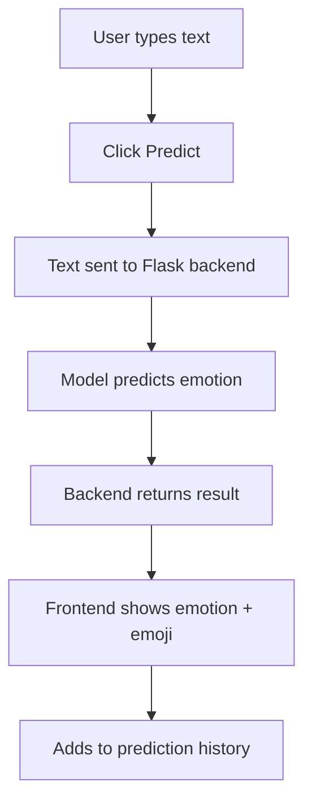

# 🎭 MoodMirror

✨ *Find the Mood Behind the Words* ✨


## 📌 Overview

**MoodMirror** is an interactive emotion classification web app that detects the **emotion behind your text** and displays it beautifully with emojis!  
It keeps a **prediction history**,  and gives a satisfying visual experience - all using **Flask + Vanilla JS**.

---

## ✨ Features
- 🔍 Predicts emotions like *joy*, *sadness*, *anger*, *fear*, etc.
- 😊 Shows an emoji along with the prediction
- 🧠 Maintains prediction history
- 💻 Built with Flask, HTML, CSS, JS

---

## 🧰 Tech Stack
| Layer       | Technology        |
|-------------|-------------------|
| Frontend    | HTML, CSS, JavaScript |
| Backend     | Python (Flask)    |
| ML Model    | Naïve Bayes (TF-IDF + Preprocessing) |
| Styling     | Pure CSS          |

---

## 🚀 How It Works


---

## 🛠 Setup & Run
🔃 Clone the Repository
```bash
git clone https://github.com/mihikkaS/moodmirror.git
cd moodmirror
```
🐍 Create a Virtual Environment (optional)
```bash
python -m venv venv
source venv/bin/activate  # Windows: venv\Scripts\activate
```
📦 Install Dependencies
```bash
pip install flask
```

▶️ Run the App
```bash
python app.py
```
Then open your browser and go to 👉 http://127.0.0.1:5000/

## 🧠 ML Model Info
The model takes text input and returns:

- 🎭 emotion: A label like joy, anger, sadness, etc.

- 😊 emoji: An emoji representing that emotion

🗂 You can use datasets like:

- HuggingFace Emotion Dataset

- Kaggle Emotion Dataset

## 📜 License
This project is open-source. Feel free to modify and reuse it with attribution. ❤️

